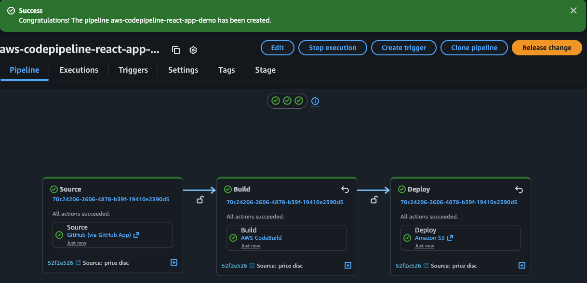

[](https://private-user-images.githubusercontent.com/110755734/293723213-01cd6124-8014-4baa-a5fe-bd227844d263.png?jwt=eyJ0eXAiOiJKV1QiLCJhbGciOiJIUzI1NiJ9.eyJpc3MiOiJnaXRodWIuY29tIiwiYXVkIjoicmF3LmdpdGh1YnVzZXJjb250ZW50LmNvbSIsImtleSI6ImtleTUiLCJleHAiOjE3NjE5MTg2NTgsIm5iZiI6MTc2MTkxODM1OCwicGF0aCI6Ii8xMTA3NTU3MzQvMjkzNzIzMjEzLTAxY2Q2MTI0LTgwMTQtNGJhYS1hNWZlLWJkMjI3ODQ0ZDI2My5wbmc_WC1BbXotQWxnb3JpdGhtPUFXUzQtSE1BQy1TSEEyNTYmWC1BbXotQ3JlZGVudGlhbD1BS0lBVkNPRFlMU0E1M1BRSzRaQSUyRjIwMjUxMDMxJTJGdXMtZWFzdC0xJTJGczMlMkZhd3M0X3JlcXVlc3QmWC1BbXotRGF0ZT0yMDI1MTAzMVQxMzQ1NThaJlgtQW16LUV4cGlyZXM9MzAwJlgtQW16LVNpZ25hdHVyZT01ZDhhNWQ5NDAzMDBlZmZiMzVhNjM5NjU3ODk5NDVhOGU5NTEwZDhkNDM1NGM0ODlmODdjZWU0NGUxNjNkY2QzJlgtQW16LVNpZ25lZEhlYWRlcnM9aG9zdCJ9.zfnjIyEPXBO3EmNhLjhVhy9G8jKa0xwUqJc1_D8XrHs) Deploy React App with Full CI/CD Pipeline on AWS | GitHub + CodePipeline + S3


Introduction
---------------

In this tutorial, you'll learn how to build a fully automated CI/CD pipeline using AWS CodePipeline, CodeBuild, and Amazon S3 to deploy a React.js application hosted on GitHub. No need for manual deployments, every time you push to your repo, your app will automatically build and deploy to a static website on S3!

How it Works:
----------------

1.  Push code to the `main` branch on GitHub.
2.  AWS CodePipeline detects the change.
3.  AWS CodeBuild installs dependencies and builds the React app.
4.  The build output is deployed to the S3 bucket.
5.  S3 serves the app as a public static website.

Step 1 - Setup your React.js App on GitHub
---------------------------------------------

First, we'll set up a React app by cloning the React app from my GitHub repository. You can use your own or follow along with mine. Make sure the app is committed to GitHub.

```source-shell
git clone https://github.com/leswlk/saas-landing-page.git
```

Step 2 - Create S3 Bucket for Hosting
----------------------------------------

For the deploy provider we are going to use Amazon S3, we will create an S3 bucket.

1.  Head over to the S3 service.
2.  Click Create bucket.
3.  Name it something unique like `demo-react-cicd-bucket`


Once the s3 bucket is created, leave it for now, as we will come for it to finish the setup later.

Step 3 - Create CodePipeline
-------------------------------

Now the fun part---building the pipeline.

1.  Go to AWS CodePipeline, click Create pipeline.
2.  Name your pipeline: `aws-codepipeline-react-app-demo`
3.  Choose a new service role or an existing one.


4.  Add source stage:
    - Source provider: GitHub (connect your GitHub account).
    - Select your repository and branch.

Note: Make sure you select the repository that we cloned in Step 1
Once you are connected to your Github and select your repository, then choose "Next"


5.  Add build stage:
    - Provider: AWS CodeBuild.
    - Choose "Create project"

Let's proceed to next step and create the CodeBuild Project.

Step 4 - Create CodeBuild Project
------------------------------------

Now let's set up CodeBuild, which will handle building the React app.

1.  Go to CodeBuild, click Create Build Project.
2.  Give it a name, something fuego!


3.  Choose a managed image: aws/codebuild/standard:6.0 (or latest).
4.  Under build specifications, choose "Use a buildspec file"
5.  Inside your GitHub repo, create a file named `buildspec.yml` in the root:

```source-yaml
version: 0.2

phases:
  install:
    runtime-versions:
      nodejs: 18
    commands:
      - echo Installing dependencies...
      - npm ci --legacy-peer-deps

  build:
    commands:
      - echo Building the React app...
      - npm run build

artifacts:
  files:
    - '**/*'
  base-directory: dist
  discard-paths: no

```

Note: This file tells CodeBuild to install dependencies, build the app, and copy the contents of the build folder as artifacts.

1.  Back to the CodeBuild Project, keep the rest as default and choose "Continue to CodePipeline"
2.  Then the CodeBuild project will be create and added to the build stage as shown below, then choose "Next"


1.  Add deploy stage:
    - Provider: Amazon S3.
    - Bucket: Select the one you created earlier `demo-react-cicd-bucket`
    - Extract file option: YES, choose "Next"


- Lastly, review all the configuration and click "Create pipeline"

Once the pipeline is successfully created, you'll see it run through the `source` `build` and `deploy` stages.

Finish up S3 Bucket configuration
-----------------------------------------

1.  Go to Amazon S3 console
2.  Select our existing S3 bucket `demo-react-cicd-bucket`
3.  You should see the S3 bucket with objects inside, extracted from our CodePipeline.
4.  Now let's make this S3 Bucket public:\
    - On the top bar, choose "Properties"


- Scroll down to "Static Website Hosting" and click "Edit"


- Under "Static Website Hosting", choose "Enable"
- And specify `index.html` as the index document, then click "Save"


- Next, edit some permissions, while still on the top bar choose "Permissions"
- Uncheck "Block all public access" to allow public access, then click "Save changes"


- Next, we will add a bucket policy to allow public read access inside our s3 bucket. Here's the sample policy you can use:

```source-json
{
  "Version": "2012-10-17",
  "Statement": [
    {
      "Sid": "PublicReadGetObject",
      "Effect": "Allow",
      "Principal": "*",
      "Action": "s3:GetObject",
      "Resource": "arn:aws:s3:::your-bucket-name/*"
    }
  ]
}
```

Replace: `your-bucket-name` with your actual bucket name, then click "Save"

- Go back to the S3 Bucket console, on the top bar, choose Objects, then click on `index.html`\
- To visit your React.js App, click on the Object URL.


- You should see your React.js App running on Amazon S3


Step 5 - Test the Pipeline
-----------------------------

Alrighty, time to test the whole pipeline. Let's say that during development of the app, a junior developer wanted to make a little joke on the senior team since he overheard someone mentioning food in an earlier meeting. But, since he accidentally pushed to production:


Wings are good, can't blame em. But, as soon as the code is pushed, CodePipeline is triggered. You'll see it run through the source, build, and deploy stages.



Clean Up Resources
---------------------

When you're done, remember to clean up your AWS resources to avoid an unwanted surprise waiting for you at the end of the month!
